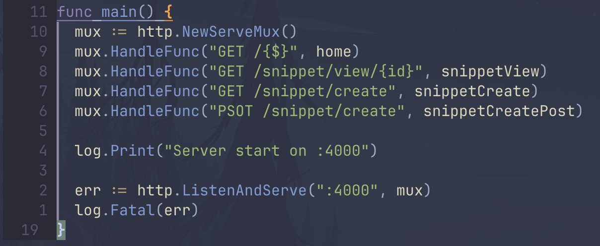

[![Contributors][contributors-shield]][contributors-url]
[![Forks][forks-shield]][forks-url]
[![Stargazers][stars-shield]][stars-url]
[![Issues][issues-shield]][issues-url]
[![MIT License][license-shield]][license-url]
[![LinkedIn][linkedin-shield]][linkedin-url]

<!-- PROJECT LOGO -->
 

  

  <h3 align="center">Snippetbox</h3>

  

    Learning Golang - Keep your notes somewhere.
     
     
    <a href="#">View Demo</a>
    ·
    <a href="https://github.com/guimochila/snippetbox/issues/new?labels=bug&template=bug-report---.md">Report Bug</a>
    ·
  

## About The Project

Snippetbox is a project like Pastebin, this is for learning purpose only.

Reasons:
* Learning Golang 
* Applying Golang for web development 

This project is following the book *(Let's go)[https://lets-go.alexedwards.net/]* 

[contributors-shield]: https://img.shields.io/github/contributors/guimochila/snippetbox.svg?style=for-the-badge
[contributors-url]: https://github.com/guimochila/snippetbox/graphs/contributors
[forks-shield]: https://img.shields.io/github/forks/guimochila/snippetbox.svg?style=for-the-badge
[forks-url]: https://github.com/guimochila/snippetbox/network/members
[stars-shield]: https://img.shields.io/github/stars/guimochila/snippetbox.svg?style=for-the-badge
[stars-url]: https://github.com/guimochila/snippetbox/stargazers
[issues-shield]: https://img.shields.io/github/issues/guimochila/snippetbox.svg?style=for-the-badge
[issues-url]: https://github.com/guimochila/snippetbox/issues
[license-shield]: https://img.shields.io/github/license/guimochila/snippetbox.svg?style=for-the-badge
[license-url]: https://github.com/guimochila/snippetbox/blob/master/LICENSE.txt
[linkedin-shield]: https://img.shields.io/badge/-LinkedIn-black.svg?style=for-the-badge&logo=linkedin&colorB=555
[linkedin-url]: https://linkedin.com/in/guilhermescaldelai
